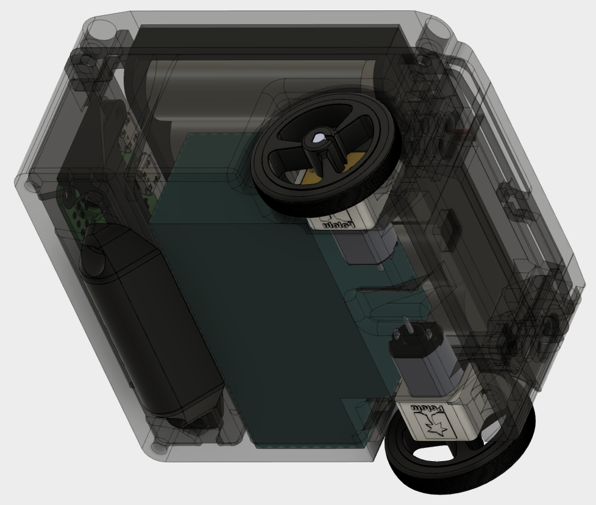

# testbot86

## Chassis v1.0.0 (Design frozen April 2019)

Internals are the same as v0.0.1 internals shown below. Vertical space has been slightly increased from v0.0.1 and the chassis is more rigid.

## v0.0.1 "TripleBlack" (Prototype 1, June 2018)

#### CAD

CAD files are in the v001 folder.

v0.0.1 had a front cover panel/mounting area that is removed as of v1.0.0, which has mounting holes on the top cover.

#### Layout

* Red: Raspberry Pi Zero
* Orange: USB Hub with WiFi adapter (not needed with Raspberry Pi Zero W)
* Yellow: Arduino-compatible Atmega328 controller board
* Green: TB6612 motor driver board
* Cyan: [Pololu N20 metal gearmotors](https://www.pololu.com/product/3073)
* Blue: [Pololu magnetic encoders](https://www.pololu.com/product/3081)
* Magenta: L3GD20H gyro

#### 3D Printed Body

