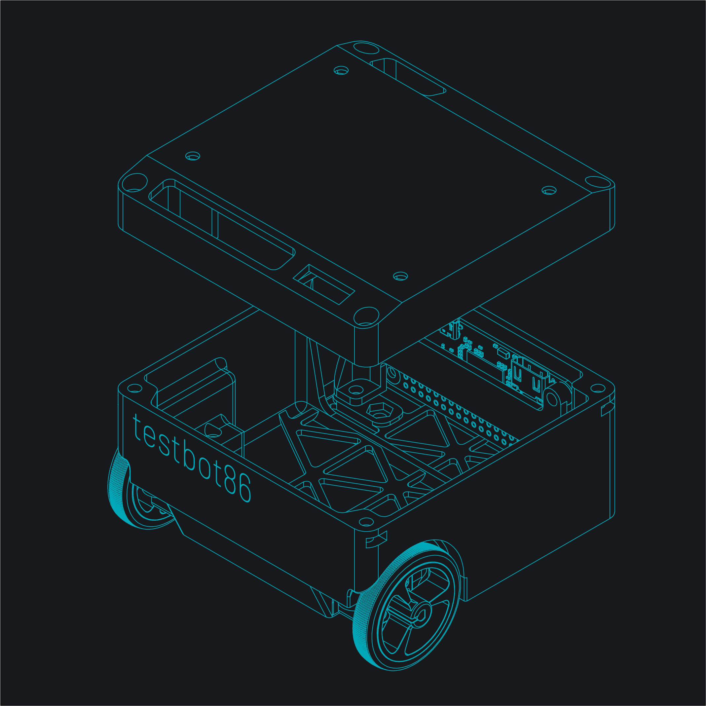
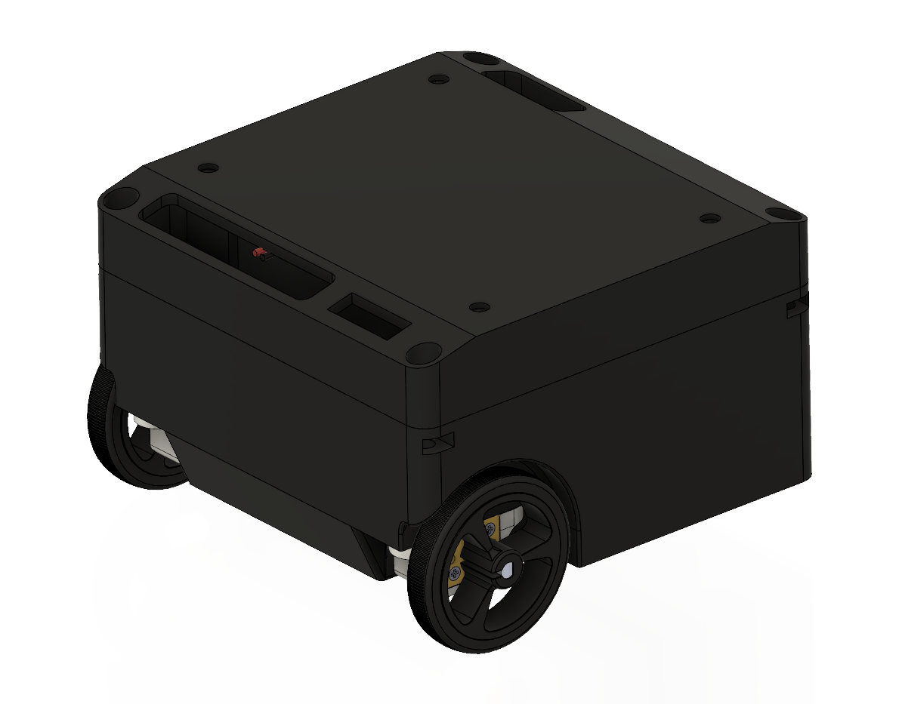
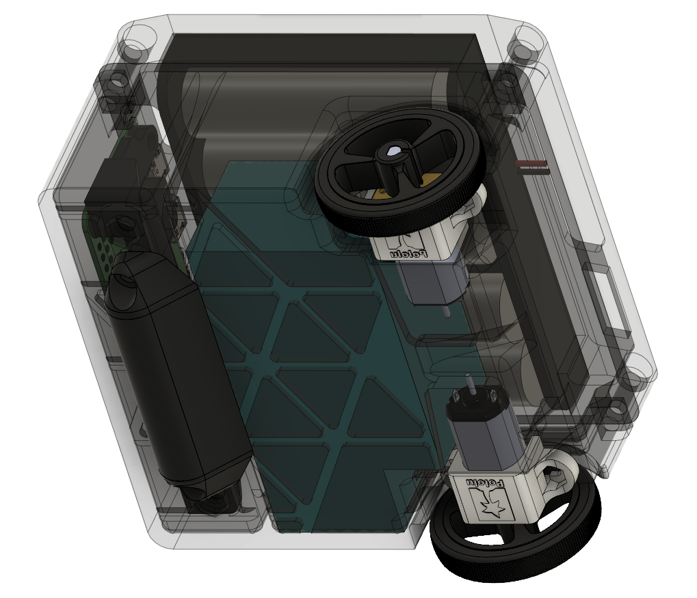
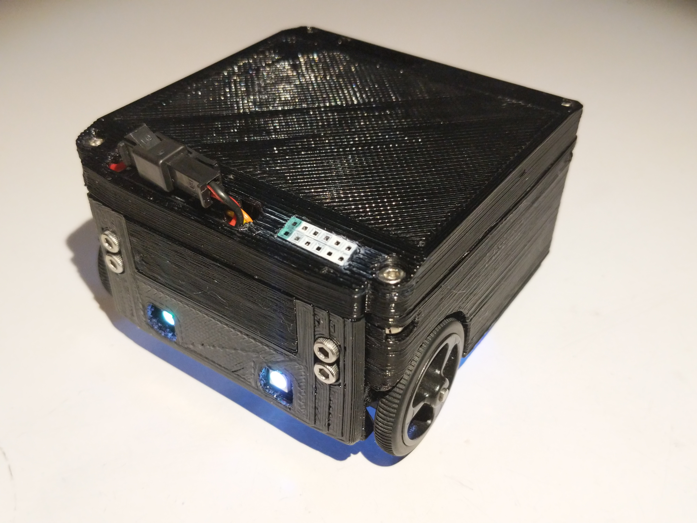
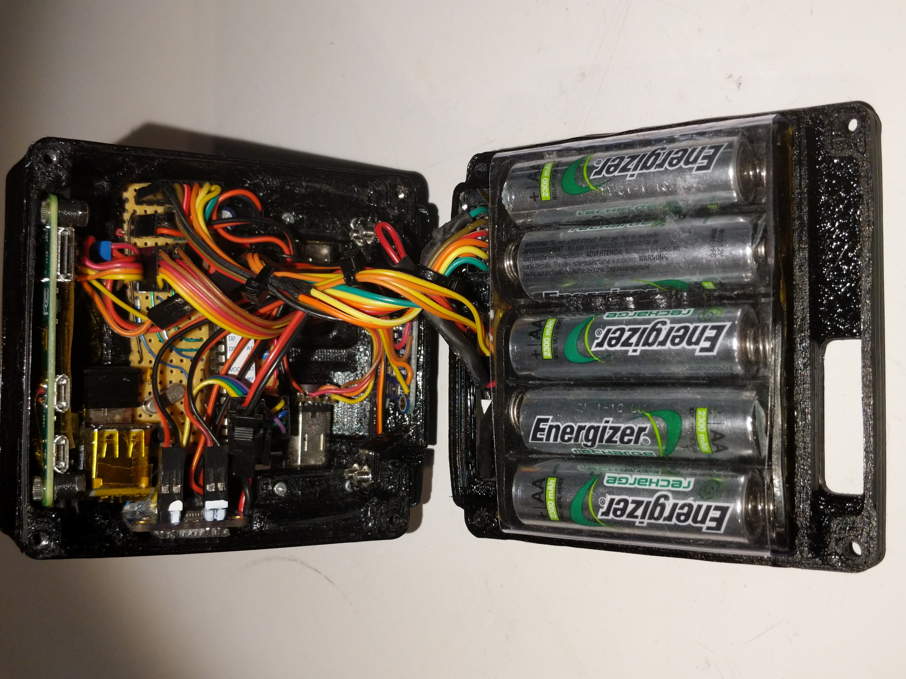
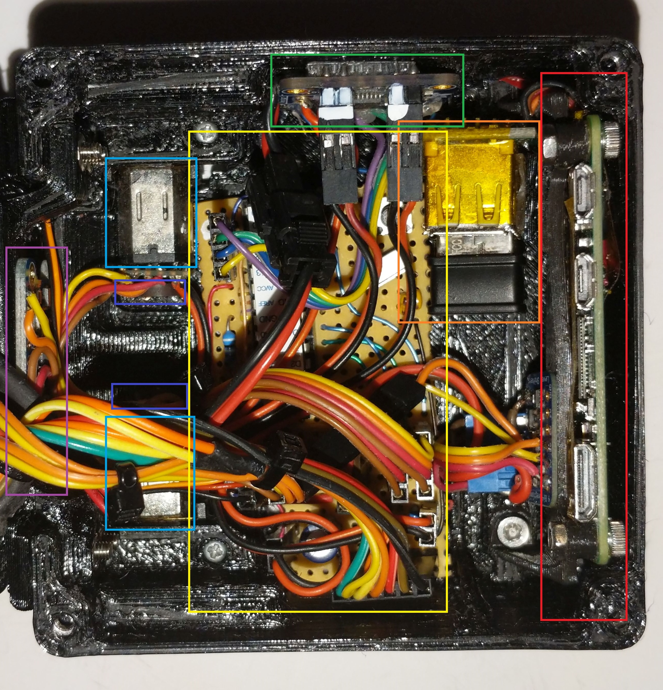
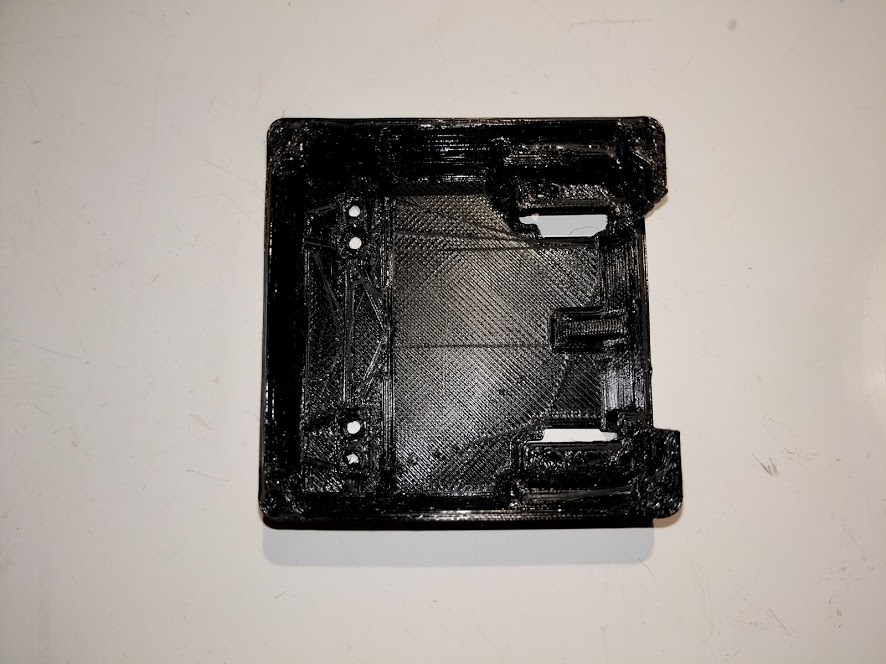

# testbot86

## Chassis CAD v1 (April 2019)

CAD files are located in the v100 folder.

Internals are the same as the prototype internals shown below. Vertical space has been slightly increased and the chassis has been stiffened. 

## Prototype 1 "TripleBlack" (June 2018)

#### Layout

* Red: Raspberry Pi Zero
* Orange: USB Hub with WiFi adapter (not needed with Raspberry Pi Zero W)
* Yellow: Arduino-compatible Atmega328 controller board
* Green: TB6612 motor driver board
* Cyan: [Pololu N20 metal gearmotors](https://www.pololu.com/product/3073)
* Blue: [Pololu magnetic encoders](https://www.pololu.com/product/3081)
* Magenta: L3GD20H gyro

#### 3D Printed Body

