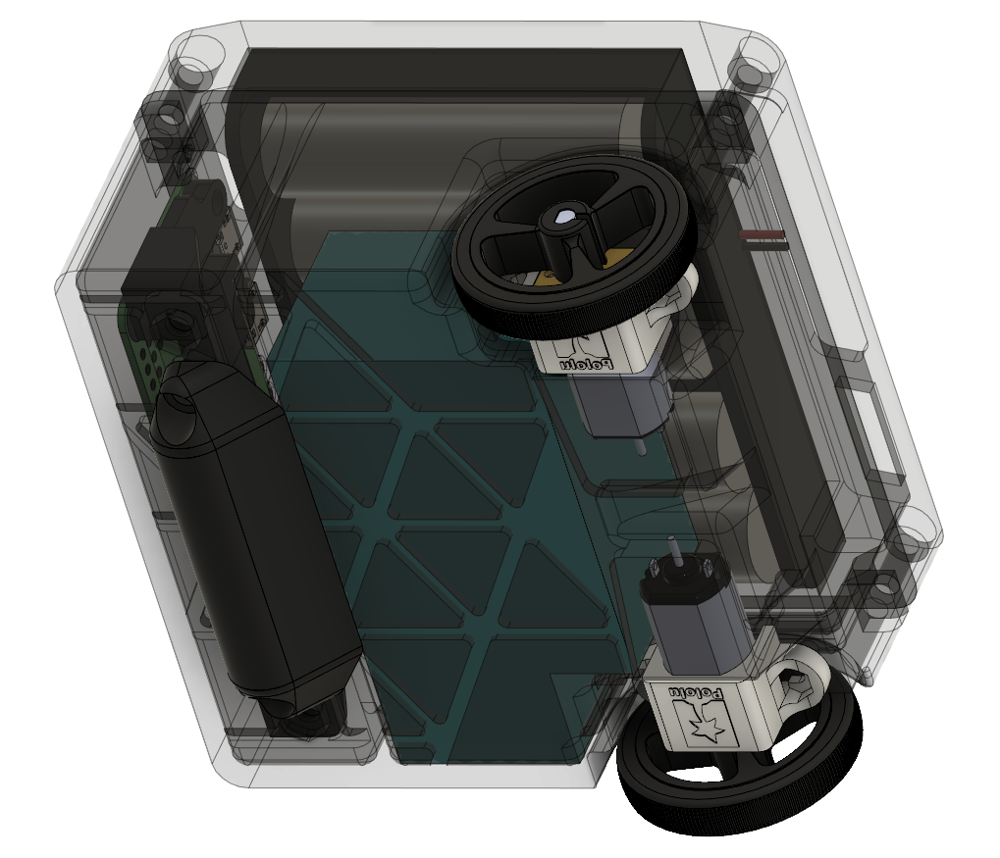
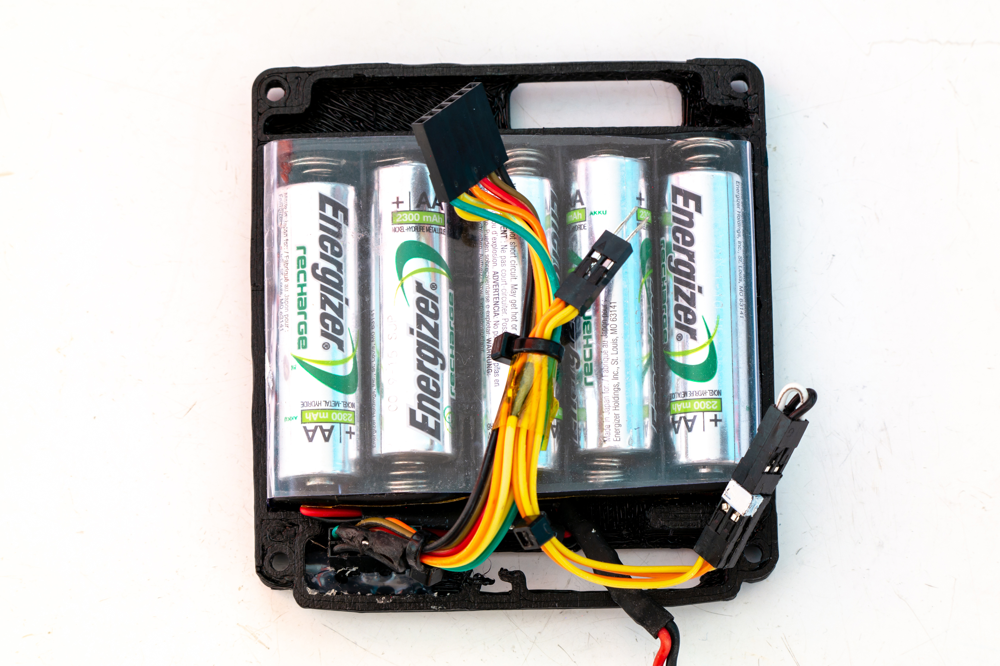

# testbot86

## v1 "TripleBlack" (April 2019)

CAD files are located in the v100 folder. The prototype robot shown in photos has a modified front panel but is otherwise identical to the v1 CAD model.

### Internals

#### Major Components Used
* Raspberry Pi Zero for high-level control and web interface
* USB Hub and USB WiFi adapter (not needed with Raspberry Pi Zero W)
* Optional USB camera
* Bidirectional logic level shifter (Pololu #2595, Adafruit #757)
* Arduino-compatible Atmega328 controller board for low-level hardware control
* L3GD20H gyro on breakout board (Pololu #2129, Adafruit #1032)
* TB6612 motor on breakout board (Pololu #713, Adafruit #2448)
* [Pololu N20 metal gearmotors](https://www.pololu.com/product/3073)
* [Pololu magnetic encoders](https://www.pololu.com/product/3081)
* [Pololu S7V7F5 switching voltage regulator](https://www.pololu.com/product/2119)

### Software
[robot-bridge-firmware](https://github.com/jackw01/robot-bridge-firmware) and [robodashboard](https://github.com/jackw01/robodashboard)
