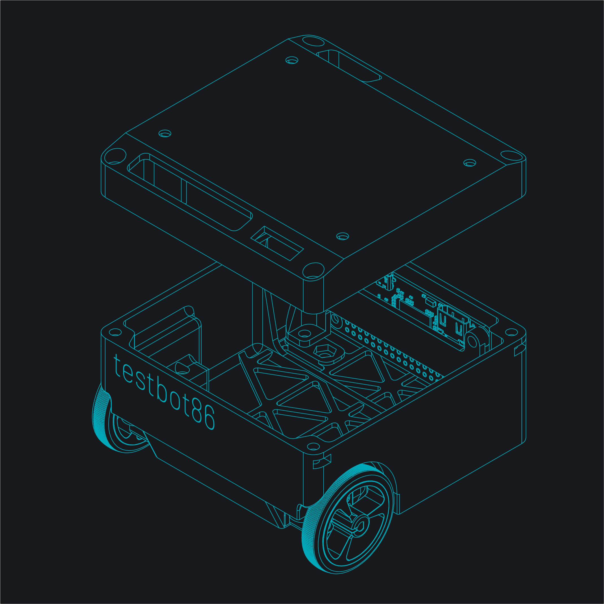
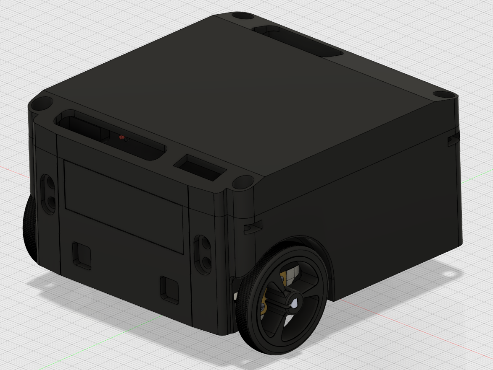

# testbot86
Mobile robot platform that fits a Raspberry Pi Zero and more into a tiny 86mm square package: CAD and image repository

## v1.0.0 (Design frozen April 2019)

v1.0.0 internals are the same as v0.0.1 internals shown below.

## v0.0.1 (Prototype 1, June 2018)

